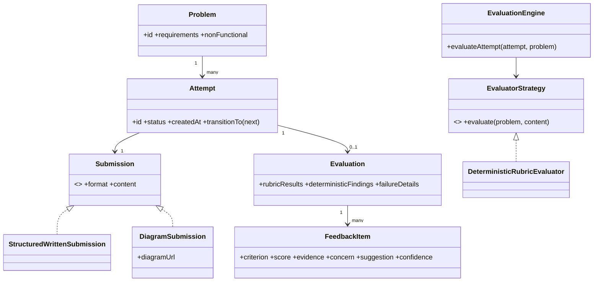

# DesignGym Design Note

## Product fit for CipherSchools

DesignGym is a focused practice surface inside a CipherSchools software-development and interview-preparation journey. It converts course knowledge into repeatable design judgment through a small loop: choose an LLD problem, make reasoning visible, receive evidence-linked feedback, identify a next move, and retry without losing history.

The product complements rather than duplicates a learning platform. CipherSchools can teach object-oriented design, patterns, and coding fundamentals; DesignGym supplies application, reflection, and measurable improvement signals.

## Product flow

A learner selects one of four curated LLD problems and starts an attempt. The practice workspace keeps the requirements visible beside six structured evidence fields: assumptions, classes and interfaces, responsibilities, interactions, edge cases, and trade-offs. Draft content is preserved locally for the fast prototype and can also be persisted through the authenticated backend.

On submission, the attempt follows an explicit lifecycle. The practice flow never jumps directly from a draft to a completed review. Evaluation is an orchestration boundary, so a slow or unavailable primary evaluator can fall back to deterministic feedback while preserving the original submission and explaining the fallback.

## Attempt state machine

```text
DRAFT → SUBMITTED → EVALUATING → COMPLETED
                              ↘ FAILED
```

The implementation uses the title-cased equivalents `Draft`, `Submitted`, `Evaluating`, `Completed`, and `Failed`. Legal transitions are:

| Current state | Allowed next states | Meaning |
| --- | --- | --- |
| `Draft` | `Submitted` | The learner has submitted a draft for review. |
| `Submitted` | `Evaluating`, `Failed` | Evaluation has started, or pre-evaluation handling failed. |
| `Evaluating` | `Completed`, `Failed` | A review is available, or all evaluation paths failed. |
| `Completed` | None | The reviewed attempt is immutable and terminal. |
| `Failed` | None | The failed attempt is retained for diagnosis and retry. |

`transitionAttempt` is the single guard for these changes and throws `InvalidStateTransitionError` for illegal jumps such as `Draft → Completed` or `Completed → Draft`.

## Domain model



The concrete TypeScript model keeps the current structured content shape compatible with the UI while exposing `Submission`, `StructuredWrittenSubmission`, and `DiagramSubmission` as the extension boundary. `EvaluationEngine` owns lifecycle orchestration; `EvaluatorStrategy` owns judgment.

## Section 9: Two Simple Change Tests

### Change Test A (Text to Class Diagram)

The current MVP uses a structured written submission, represented by `StructuredWrittenSubmission`. A future diagram workflow can add `DiagramSubmission` with a `diagramUrl` or storage reference. The `Submission` strategy/polymorphism boundary means the new class supplies the same `format` and `content` contract; `Attempt` still owns lifecycle and identity, and `EvaluationEngine` still owns orchestration. No change is required to `Attempt` or to the evaluation lifecycle merely because the learner chose a different submission format.

The practical test is: add `DiagramSubmission`, instantiate it in a fixture, and verify that the same attempt state machine accepts it without changing `Attempt`, review navigation, or persistence orchestration.

### Change Test B (Pluggable Evaluators)

`EvaluatorStrategy` is the evaluator contract. `DeterministicRubricEvaluator` is the reliable baseline, while a `HumanReviewEvaluator`, `RuleBasedEvaluator`, or future LLM adapter can implement the same `evaluate(problem, content)` operation. `EvaluationEngine` receives the primary strategy and a deterministic fallback; practice logic only submits content and observes the resulting attempt.

The practical test is: inject a fixture evaluator, human review adapter, or failing LLM adapter into `EvaluationEngine` and verify that practice logic remains unchanged. A primary failure produces deterministic feedback with `source: "deterministic-fallback"`; if both paths fail, the attempt reaches `Failed` safely.

## Boundaries and variation points

| Boundary | Responsibility | Future replacement |
| --- | --- | --- |
| Problem data | Owns scenario, requirements, concepts, and difficulty | Database-backed problem repository |
| Attempt lifecycle | Rejects invalid transitions and preserves history | Server-side aggregate with optimistic concurrency |
| Submission strategy | Encodes text, diagram, or code evidence | Diagram editor or code submission adapter |
| Evaluator strategy | Returns explainable rubric feedback | LLM evaluator, human review queue, or rule-based evaluator |
| Evaluation engine | Coordinates states, timeouts, and fallback | Background job or workflow worker |
| Weakness aggregator | Derives recurring criteria from history | Progress service or analytics projection |

## Feedback contract and resilience

Every rubric item contains `Criterion → Score → Evidence → Concern → Suggestion`, plus a confidence signal. `parseRubricEvaluation` validates structured JSON output, clamps scores to 0–100, derives the signal, and rejects malformed output rather than silently displaying unsafe feedback. Deterministic findings remain separate from judgment-oriented feedback.

`EvaluationEngine` transitions a submitted attempt into `Evaluating`, awaits the primary strategy, and safely transitions to `Completed` on success. If the primary strategy times out or throws, the deterministic evaluator runs with the original submission. The completed evaluation records the fallback source and failure details. If the fallback also fails, the engine transitions to `Failed` without crashing or losing the learner’s content.

## Tests and integrity

The Vitest suite covers legal and illegal state transitions, malformed and empty payloads, strategy substitution, diagram submission extension, primary evaluator failure fallback, total evaluator failure, structured rubric JSON parsing, deterministic findings, and repeated weakness aggregation. The full-stack application additionally protects account settings and persists users, attempts, and authentication tokens through SQL-backed procedures.

## Trade-offs

The implementation remains intentionally monolithic for a focused assignment boundary. It uses a typed domain module, tRPC procedures, and a SQL-backed user/attempt layer rather than introducing queues or microservices. This keeps the two-day LLD boundary understandable while leaving explicit seams for a background evaluator, additional submission formats, expert review, and richer analytics.
